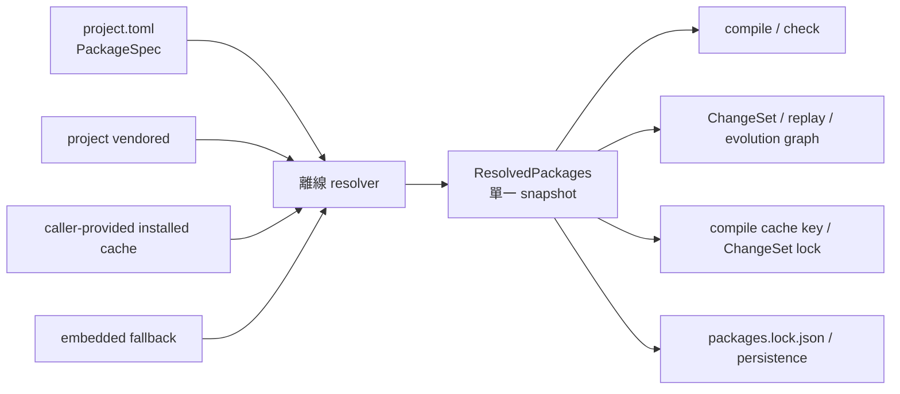

# Package Loader v2（Phase A）

> 狀態：`feat/package-loader-v2` 的實作契約。語言層、ChangeSet、lock、persistence，
> 以及 app 的 canonical project-open／workspace compile 流程均已完成 v2 接線。
> 本文只描述 Phase A 已落地的行為，不預告 qualified symbol 等後續語法。

Package Loader v2 把「專案想要哪些套件」與「這次實際使用哪些套件 bytes」分開：

- `PackageSpec` 是作者意圖，只列直接 roots 與 project-local aliases；
- `LibraryCatalog` 是本次離線可見的候選集合；
- `ResolvedPackages` 是一次解析產生的不可變 snapshot，後續 compile、check、
  ChangeSet、cache 與 lock 都必須消費同一份 snapshot；
- `packages.lock.json` 保存包含遞移依賴的精確解析結果。



## 1. Phase A 的明確邊界：仍使用全域 bare export alias

Phase A **沒有**實作或宣稱 `.lang`／`.chg` 的一般 qualified-symbol 語法。

- `config/exports.tsv` 的 `alias` 仍是單一 bare identifier；
- 建立 catalog 時，所有保留下來的 package 之 bare export alias 必須全域唯一；
  不同 package 匯出相同 alias 會得到 `DuplicateAlias`，即使它們不會同時成為 roots；
- export stable ID 也必須全域唯一，且必須以 `<package-id>:` 開頭；
- `PackageSpec.aliases`／`project.toml` 的 `[packages.aliases]` 目前只保存 project-local
  qualifier 意圖，並驗證 target package 確實在選取閉包內；它尚未接入 DSL symbol lookup；
- 因此不要把 `case = "catalog:case"` 解讀成 `.lang` 已可寫 `case::Noun`，也不要據此
  宣稱 `.chg` 已有通用 qualified trait/sign/function lookup。既有 `.chg` function naming
  行為是另一個既有契約，並不等於 loader v2 已完成一般名稱限定。

移除全域 bare alias 唯一性、定義消歧規則與把 project aliases 接入 parser／IR／
diagnostic，是後續 Phase B；不屬於本文的完成條件。

## 2. 身分與相容層

### 2.1 `PackageId` 是 open namespace

穩定身分格式是 `<namespace>:<name>`，例如：

```text
catalog:case
dataset:grambank-v1
theory:usage-based-cxg
natural:en-standard
```

namespace 不再由 `LibraryKind` 的 closed enum 決定。namespace 與 name 都必須非空，
字元限 Unicode alphanumeric、`_`、`-`；多出的 `:`、空白與 path-like 字串都不是合法 ID。
`PackageId` 的 parse/display 是 canonical round trip。

`LibraryId` 目前是 `PackageId` 的遷移 type alias；`LibraryKind::{Std,Natural,Plugin}`
與 `PackageId::legacy_kind()` 仍保留給 legacy 邏輯，但 `catalog:*`、`dataset:*`、
`theory:*` 或專案自訂 namespace 不必新增 enum variant。

### 2.2 v1 檔案／行為相容性與 Rust API 斷點

| 舊入口 | Phase A 行為 | v2 對應入口 |
|---|---|---|
| schema-1 `package.conf` | 繼續讀取 `kind/name/version/rule_namespace/enabled/priority/requires/code/functions/data` | schema-2 `package.toml` |
| `LibrarySpec { std, natural, plugins }` | 繼續可用，經 `PackageSpec::from_legacy`／`resolve_legacy` 轉入 resolver | `PackageSpec { roots, aliases }` |
| 舊 `project.toml` 的 `std/natural/plugins` | 繼續可讀並轉成 v2 intent | `[packages].roots`／`[packages.aliases]` |
| 舊 compile/check/ChangeSet API | 繼續保留，通常會自行使用 embedded catalog | 先 resolve 一次，再呼叫 `*_with_packages` |
| schema-1 package digest | 維持歷史 byte layout，避免既有 `.chg` library lock 全面失效 | schema-2 digest 額外納入 schema/layer/capabilities |

這裡的「相容」指既有 manifest、project、ChangeSet 與函式入口仍可讀／可呼叫，
**不代表 Rust source compatibility**。本分支是 loader 的 major API migration：
`LibraryId` 的 public fields 從 `kind/name` 改為 `namespace/name`；`LibraryPackage::requires`
改為 `Vec<PackageRequirement>`，並新增 manifest/layer/capabilities/source 欄位。因此下游若以
struct literal 建立這兩個型別，必須改用 `PackageId`／`PackageRequirement` 並補齊新欄位。
這項斷點必須在 major-version release note 中列出，不能只靠 type alias 宣稱 source-compatible。

schema-1 lock 的排序也刻意保留舊 `Std < Natural < Plugin` enum 順序；open namespace
則排在 legacy namespace 之後，以 namespace/name 穩定排序。這可保持含 natural/plugin 的
既有 `.chg` lock-set digest，不會因 `PackageId` 改成字串 namespace 而漂移。

同一份 `project.toml` 不得混用 v1 `std/natural/plugins` 與 v2 `roots/aliases`。

兩個 default 的語義刻意不同：

- `LibrarySpec::default()` 是 v1 compatibility default，仍選取 shipped
  `std:core`、`std:cxg`、`std:grambank`、`std:grammaticalization`；
- `PackageSpec::default()` 的 `roots` 與 `aliases` 都是空的，**不會隱式載入任何 package**。

此外，`project.toml` 不存在與存在但 packages 為空不是同一件事：前者由
`GraphStore::package_spec_or(fallback)` 使用呼叫端 fallback；後者表示明確空選取。

## 3. schema-2 `package.toml`

### 3.1 最小 `package.toml`

一個只提供 traits 的最小 schema-2 reference package 是：

```toml
schema = 2
id = "catalog:case"
version = "1.0.0"
layer = "reference"
capabilities = ["traits"]
code = ["code/case.lang"]
```

這會使用 default `exports = "config/exports.tsv"`。若同時有精確 dependency 與
資料檔，再加：

```toml
capabilities = ["traits", "data"]
requires = ["catalog:linguistic-units@1.0.0"]
data = ["data/case.tsv"]
```

省略時的 defaults：

```toml
exports = "config/exports.tsv"
enabled = true
priority = 0
# rule_namespace = id
```

`rule_namespace` 即使明寫也必須等於 package ID。`code`、`functions`、`data`
至少一組非空；各 array 的順序是 package 內容順序，也會影響組合內容與 digest。
schema 2 拒絕未知 manifest 欄位。

version 是精確、不透明字串：必須非空，不能含空白、控制字元或 `@`；目前不做 SemVer
range solving。`PackageRequirement` 支援 `catalog:case@1.0.0` 的 exact form；無 `@`
形式只為未 pin／legacy compatibility。exact root 或 `requires` 以字串完全相等檢查，
不相等即 `VersionMismatch`，不會自動升降版。

對應的 `exports.tsv` 仍是：

```tsv
stable_id	kind	alias
catalog:case:Nominative	trait	Nominative
catalog:case:Accusative	trait	Accusative
```

`kind` 是 `trait`、`sign` 或 `function`。每一列都必須同時滿足：stable ID 前綴正確、
alias 對應內容確實存在、manifest capability 授權該 kind。

### 3.2 layers

| layer | 進入選取結果的位置 | 內容限制 |
|---|---|---|
| `reference` | `LibrarySelection.standard` | `.lang` 只能提供非-global trait declarations，不可提供 signs、DSL declarations 或 distribution |
| `overlay` | `LibrarySelection.overlay` | 可提供具體語言／理論 overlay；仍受 capabilities 約束 |
| `data` | 不把 `.lang` nodes 合併進語言 | 不得有 language declarations；可承載 data 與 functions |

選取排序以 layer rank `reference < data < overlay`、`priority`、package ID 決定；
依賴仍先於依賴者。cycle、disabled package、未知 dependency 與重複選取名稱都會硬錯。

### 3.3 capabilities

schema 2 的 capabilities 是獨立 flags：

```text
traits, signs, functions, data
```

capability 是授權，不是單純描述。package 提供未授權的 trait/sign、function file、
data file 或 export 時，load 立即失敗。只宣告 `data` 的 data-layer package 可以沒有
`exports.tsv` 內容；只要 capabilities 含 `traits`、`signs` 或 `functions`，export table
就不能以「data-only 零 exports」規則略過。

## 4. 離線解析與 source precedence

production host 的離線候選順序是：

```text
project-vendored  >  caller-provided installed cache  >  shipped embedded
```

- `GraphStore::read_vendored_packages()` 遞迴讀取 `<project>/packages/**/package.toml`；
- installed tier 目前由呼叫端以 `PackageSources` 傳入，loader 本身沒有 registry、下載、
  update 或網路 fallback；
- embedded package 只作最低優先 fallback；
- 相同 `PackageId` 在較高 tier 完全取代較低 tier；同一 tier 出現重複 ID 則拒絕；
- precedence 先決定唯一候選，才檢查 exact version。因此 vendored `x@2` 覆蓋 installed
  `x@1` 後，專案要求 `x@1` 會得到 version mismatch，不會悄悄繞過 vendored 回退；
- `LibraryCatalog::with_packages()` 是 host/test injection 入口：它把 injected packages
  與 embedded 合併並套用相同 catalog validation，但不是上述 override chain；重複 ID
  仍會失敗；
- `PackageSource::{Vendored,Installed,Embedded,Injected}` 保存 provenance。semantic package
  digest 不因相同 bytes 移動 tier 而改變，但 project lock 仍另外驗證 source kind/location。

roots 只列直接依賴；resolver 展開每個 manifest 的遞移 `requires`，做 cycle/version/
enabled 檢查，最後得到 deterministic topological selection。

## 5. `ResolvedPackages`：唯一可重用的解析 snapshot

`PackageResolver::resolve(&PackageSpec)` 一次產生 `ResolvedPackages`，內容包含：

- 原始 `intent`（roots、aliases）；
- `selection.standard`、`selection.overlay` 與有序 package IDs；
- 每個已選 package 的 exact `id/version/digest/source/layer`；
- 已選 package 的完整 `LibraryPackage` bytes；
- catalog export index，供 unknown-name／missing-import diagnostic hint 使用。

後續層不得從 roots 以另一份 catalog 重做解析。canonical 資料流是：

```rust
let spec = project.to_package_spec()?;
let packages = store.resolve_project_packages(&project, installed_sources)?;

let report = conlang_language::check_document_with_packages(&document, &packages);
let compiled = conlang_language::compile_document_with_packages(&document, &packages)?;
let resolved_change = unresolved.resolve_packages(&document, &packages)?;
```

若 `packages.lock.json` 已存在，`resolve_project_packages` 會先離線重解，再以
`PackagesLock::verify_resolved` 比對完整 package set 及每個 package 的
version/digest/source/layer；任一差異都拒絕 project open。不存在 lock 則是第一次解析，
呼叫端可用 `write_resolved_packages_lock` 寫入。

## 6. Public API 對照

### 6.1 language compile/check

| 用途 | v2 API |
|---|---|
| resolve | `PackageResolver::resolve`、`LibraryCatalog::resolve_legacy` |
| source check | `check_language_with_packages` |
| identity-aware document check | `check_document_with_packages` |
| compile `Language` | `compile_with_packages_ref` |
| compile `LanguageDocument` | `compile_document_with_packages` |

這些 `*_with_packages` 入口不查 filesystem、不建立 catalog，也不重新解析 dependency
intent；它們直接使用 snapshot 內的 standard/overlay/export index/package IDs。

### 6.2 app session 與 compile cache

- `CompileKey::of_with_packages` 以 document digest、identity digest、
  `ResolvedPackages::lock_digest()`、完整 resolver-visible export-index digest 與 compiler
  semantics version 建 key；未選取 package 雖不改 grammar bytes，仍可能改變 dependency
  diagnostic／ontology suggestions，因此不能共用同一 cache entry；
- `CompileService::{get_with_packages,peek_with_packages}` 使用同一 snapshot；
- legacy `CompileKey::of`／`CompileService::get` 仍為 v1 compatibility。

canonical app 流程已使用同一份 resolved snapshot：

- `Session::open_project` 以空的 installed tier 呼叫
  `Session::open_project_with_installed`；後者讀取 project intent，依 vendored／installed／
  embedded precedence 離線 resolve，驗證既有 lock，再以 `load_with_packages` restore graph；
- 沒有 `project.toml` 時，fallback `LibrarySpec` 會先轉成 v2 `PackageSpec`，解析後同樣驗證
  既有 lock；因此 canonical open 不會退回另一次 legacy catalog lookup；
- `Session::new_with_packages` 回傳 `Result`，並要求 graph 已攜帶 package context，且該
  context 的 `intent` 與 `selection.resolved` 必須和傳入 snapshot 完全一致；
- `Session::packages` 公開該 snapshot。pending preview、ChangeSet resolve 與 replay 也都從
  session 使用它；
- `Session::persist` 寫入 graph 後，會以同一 snapshot 寫入 `packages.lock.json`；
- `Workspace::open_with_installed` 接受 caller-provided installed sources；
  `Workspace::compiled` 在 session 有 v2 context 時呼叫 `CompileService::get_with_packages`。
- `PackageSelectionInput` 同時保留 legacy `std/natural/plugins` shape，並新增 v2
  `roots/aliases` shape；兩者混用會在 IPC decode／寫檔前拒絕（configure 層使用
  `APP_PACKAGE_SELECTION_MIXED`）。desktop settings
  一律送出 `<open-package-id>@<exact-version>` roots，不再依 closed `kind` 分組或限制
  natural root 只能有一個。這是刻意的 UI pin policy：若原 project 使用 unversioned root，
  經 Settings 儲存後會正規化成當前 catalog 的 exact version；resolver API 本身仍接受
  unversioned requirement；
- v2 IPC 更新採 patch-like presence semantics：`roots`／`aliases` 缺席時保留既有 v2
  值，明確送出空 array/object 才清空。舊 legacy payload 不得無警告覆寫既有 v2 project；
  必須走明確 migration，否則回 `APP_PACKAGE_SELECTION_MIGRATION_REQUIRED`。

`Session::new`、`Session::libraries` 與 legacy compile APIs 仍保留作 v1 compatibility；這些
legacy 入口本身不提供「同一 host-resolved snapshot」保證。

### 6.3 ChangeSet、function 與 evolution graph

| 用途 | v2 API |
|---|---|
| resolve ChangeSet | `UnresolvedChangeSet::{resolve_packages,resolve_with_packages}` |
| interpreter/session | `ChangeInterpreter::with_packages`、`ChangeSession::with_packages` |
| function/weight data | `load_functions_from_resolved`、`load_weight_db_from_resolved`、`evaluate_function_with_packages` |
| ChangeSet prelude/lock-set digest | `change_set_prelude_with_packages`、`library_lock_digest_with_packages` |
| evolution graph | `EvolutionGraph::{new_with_packages,restore_with_packages,packages}` |

ChangeSet prelude 繼續寫：

```text
library <package-id>@<exact-version> sha256:<semantic-digest>
```

resolve/replay 在執行第一個 statement 前，比對 base source、identity manifest 與整組
package ID/version/digest。`EvolutionGraph` 的 resolved variant 持有 snapshot，commit、
restore、fsck、rebase 與 replay 不再另查 embedded catalog。

### 6.4 persistence

| 用途 | API |
|---|---|
| project intent | `ProjectDocument::{from_package_spec,to_package_spec}`、`GraphStore::{read_project,write_project,package_spec_or}` |
| vendored/offline resolution | `GraphStore::{read_vendored_packages,offline_package_catalog,resolve_packages,resolve_project_packages}` |
| graph restore | `GraphStore::load_with_packages` |
| lock model | `PackagesLock::{from_resolved,verify_resolved}` |
| lock I/O | `GraphStore::{read_packages_lock,write_packages_lock,write_resolved_packages_lock}` |

project 與 lock 各自以單檔 atomic replacement 落盤，但兩個檔案合起來不是一筆 filesystem
transaction；若更新停在兩次 replacement 之間，下一次 open 會因 intent/lock 不一致而硬錯，
不會把舊 lock 當成新 intent 的有效 lock。`read_packages_lock()` 的 `None` 表示尚無 lock，
與合法的空 package lock 不同。

## 7. `project.toml` 與 `packages.lock.json`

### 7.1 最小 v2 `project.toml`

```toml
[packages]
roots = ["catalog:case@1.0.0"]
```

目前 `ProjectDocument` 沒有獨立 schema 欄位；使用 `roots`／`aliases` 即是 v2 intent。
若要保存未來 qualifier 意圖，可另加：

```toml
[packages.aliases]
case = "catalog:case"
```

`roots` 是直接依賴；`catalog:linguistic-units@1.0.0` 由 `catalog:case` 的 manifest
遞移帶入，不必重複列入。alias target 可以是 root 或已選取的遞移 dependency，但
再次強調：Phase A 不會因此讓 `case::Nominative` 成為合法 `.lang` 語法。

legacy project 仍可使用：

```toml
[packages]
std = ["std:core", "std:grambank"]
natural = "natural:en-standard"
plugins = []
```

但不得與 `roots`／`aliases` 混用。

### 7.2 `packages.lock.json` schema

schema 常數是 `conlang-packages-lock/v1`。lock 包含 roots 與所有遞移 dependencies，
並按 package ID canonical 排序：

```json
{
  "schema": "conlang-packages-lock/v1",
  "packages": [
    {
      "id": "catalog:case",
      "version": "1.0.0",
      "digest": "0123456789abcdef0123456789abcdef0123456789abcdef0123456789abcdef",
      "source": {
        "kind": "vendored",
        "location": "packages/catalog/case"
      },
      "layer": "reference"
    }
  ]
}
```

`digest` 必須是 64 字元小寫 hex；package ID 不可重複；unknown lock 欄位、未知 layer
或未知 schema 都拒絕。實際 digest 必須由 `PackagesLock::from_resolved`／
`write_resolved_packages_lock` 產生，不應手填範例值。

三種 lock 表面必須分清楚：

- package semantic digest：`sha256(package_lock_content(package))`；schema 2 納入
  schema/layer/capabilities、ID/version/rule namespace/priority、ordered paths、requires、
  exports 與 code/function/data bytes，並只把 CRLF 正規化為 LF；
- `ResolvedPackages::lock_digest()`／ChangeSet library locks：canonical
  `id@version + semantic digest` set；
- `packages.lock.json`：再保存並驗證 source provenance 與 layer，作為 project-open
  的精確離線解析紀錄。

## 8. Offline 與 path safety

compile/check/ChangeSet/replay 接受 `ResolvedPackages` 後不碰網路或 filesystem。
filesystem 僅由 persistence host 在 resolve 前處理，而且：

- manifest 的 `exports/code/functions/data` 僅接受非空 relative paths；
- `\` 先正規化為 `/`，再拒絕 absolute path、drive/prefix `:`、空 segment、`.`、`..`；
- 同一 manifest field 中，正規化後重複的 path 會拒絕；
- vendored discovery 與逐段讀檔拒絕 symlink，並驗證 intermediate 是 directory、target
  是 regular file；
- package files 必須是 UTF-8；
- `package.toml` discovery 只在 project 的 `packages/` 之下進行，provenance location
  保存為 project-relative slash path；
- manifest、catalog、dependency cycle、capability、export 與 lock mismatch 都是 loud
  errors，不做部分載入或網路補救。

下載、registry 信任、簽章、安裝與更新是 resolver 之前的 host 工作；Phase A 只接受
已 vendored 或由呼叫端提供的 installed bytes。

## 9. 遷移步驟

1. **先保持 v1 可讀。** 不要同時刪除 schema-1 manifest、`LibrarySpec` 或 legacy
   `project.toml` 支援；先讓現有專案可經 `to_package_spec()` 進入 v2 resolver。
2. **轉換 package identity。** 把 `kind + name` 改為 open `id`；舊 `std` package
   預設審核為 `reference`，舊 `natural/plugin` 預設審核為 `overlay`，但必須依實際內容
   重新確認，不要把舊 kind 機械當成語言學理論分類。
3. **升級 manifest。** 加 `schema = 2`、`layer`、精確 `capabilities`；把 paths 與
   `requires` 改成 arrays，dependency 優先寫 exact `id@version`；確認
   `rule_namespace == id`。
4. **整理 exports。** stable ID 改為 `<package-id>:<symbol>`，並在 Phase A 內消除所有
   catalog-wide bare alias 衝突。不要以尚未存在的 qualified-symbol 語法掩蓋衝突。
5. **轉換 project intent。** 將 v1 `std/natural/plugins` 的直接依賴改寫成 v2
   `roots`；不要把 resolver 算出的所有 transitive packages 都誤寫成 roots。
6. **先離線 resolve，再產 lock。** 使用 project vendored、已安裝 cache 與 embedded
   chain 建立唯一 `ResolvedPackages`，人工確認 source/version 後呼叫
   `write_resolved_packages_lock`。更新 package 時必須明確重新 resolve 並重寫 lock；
   不得忽略 `verify_resolved` mismatch。
7. **切換 runtime API。** project open 只 resolve 一次；graph 用
   `load_with_packages`，compile/check/cache/ChangeSet/function/replay 全部改傳同一 snapshot。
8. **保留 replay 證據。** 已存在的 `.chg` 仍用原本 ID/version/digest 驗證；不要為了
   通過新版 resolver 而無理由重寫歷史 prelude 或 snapshot。
9. **最後才規劃 Phase B。** qualified symbol 必須先定義 parser、IR、alias scope、
   ambiguity diagnostic、ChangeSet serialization 與 replay contract，再解除全域 bare
   alias 唯一性。

## 10. 已知未涵蓋範圍

Phase A 刻意沒有提供：

- `.lang`／`.chg` 的通用 qualified-symbol resolver；
- 同一 `PackageId` 多版本並存；source precedence 後每個 ID 只有一個候選；
- SemVer range／SAT dependency solving；
- registry、crawler、download、signature verification、install/update；
- 對 package directory 的 adversarial concurrent mutation 防護；reader 會拒絕 traversal、
  absolute path 與掃描時可見的 symlink，但 metadata 檢查到開檔之間不是 capability-based
  `openat` transaction，host 應序列化更新並把 vendored/installed cache 視為受信本機來源；
- 自動把 `PackageSpec.aliases` 改寫成 DSL imports；
- lock mismatch 時的隱式更新或網路回退。

核心行為回歸測試位於：

- `apps/desktop/src/pages/SettingsPage.test.tsx`；
- `crates/language/tests/package_loader_v2.rs`；
- `crates/app/tests/compile_packages.rs`；
- `crates/app/tests/package_session_v2.rs`：
  - `vendored_v2_packages_drive_compile_changesets_persist_and_reopen`；
  - `fallback_open_verifies_an_existing_packages_lock`；
  - `ui_catalog_and_structured_authoring_use_the_vendored_snapshot`；
  - `project_creation_pins_packages_before_returning`；
  - `no_project_fallback_can_migrate_to_v2_and_reopen_independently`；
  - `resolved_session_rejects_legacy_or_divergent_graph_contexts`；
- `crates/persistence/tests/package_loader_v2.rs`：
  - `project_v2_round_trips_and_legacy_projects_still_migrate`；
  - `mixed_legacy_and_v2_project_intent_is_a_read_time_error`；
  - `package_lock_is_typed_canonical_and_round_trips_exact_sources`；
  - `replacing_an_existing_package_lock_exposes_only_the_complete_new_document`；
  - `vendored_reader_preserves_manifest_order_and_resolves_offline`；
  - `project_open_rejects_every_exact_lock_field_mismatch`；
  - `vendored_reader_rejects_absolute_traversal_and_unsafe_optional_exports`；
- `crates/changeset/tests/package_context_v2.rs`；
- `crates/changeset/tests/evolution_packages_v2.rs`。
